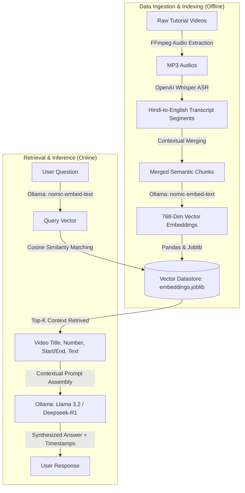

# Video-RAG: Semantic Search & Q&A Assistant for Video Course Playlists

An end-to-end **Retrieval-Augmented Generation (RAG)** pipeline designed to process video tutorials, automatically extract and transcribe Hindi audio into English text, generate high-dimensional semantic embeddings, and answer queries by guiding users to the exact video and timestamp.

This project is built to solve a real-world e-learning problem: helping students navigate hours of video tutorials to find the exact moments where specific coding concepts (e.g., *Flexbox*, *Responsive design*, *React state*) are taught.

---

## 🚀 Key Features

* **High-Fidelity ASR & Translation**: Uses OpenAI's **Whisper (`large-v2`)** to transcribe audio files, automatically translating Hindi spoken tutorials into English text segments.
* **Semantic Embeddings**: Leverages local **Nomic Embeddings (`nomic-embed-text` via Ollama)** to translate transcribed chunks into high-dimensional vectors capturing semantic context.
* **Vector Search & Similarity Matching**: Utilizes **Cosine Similarity** via `scikit-learn` to calculate similarity scores between user questions and video text chunks.
* **Contextual Answer Synthesis**: Passes retrieved context (video title, tutorial number, start/end timestamps) into local LLMs (**Llama 3.2** / **Deepseek-R1**) to synthesize conversational answers with exact navigation guides.
* **Crash-Resistant & General-Purpose**: Programmed with robust filename parsers that automatically extract video/tutorial metadata or fall back gracefully, making the pipeline compatible with any generic video format (not just specific course files).

---

## 📐 Project Architecture



---

## 🛠️ Tech Stack

* **Programming Language**: Python 3.8+
* **ML Models**: OpenAI Whisper (`large-v2`), Nomic Embed Text, Llama 3.2 / Llama 3.2-3B
* **Text Search & Match**: Cosine Similarity (`scikit-learn`, `numpy`, `pandas`)
* **Libraries**: `joblib`, `requests`, `subprocess`
* **External Tools**: `ffmpeg`, `Ollama`

---

## 🏃‍♂️ Getting Started

### 1. Prerequisites
Make sure you have Python 3.8+, **FFmpeg** installed and added to your system environment variables, and **Ollama** running locally.

* Install [Ollama](https://ollama.com/)
* Pull the required models:
  ```bash
  ollama pull nomic-embed-text
  ollama pull llama3.2
  ```

### 2. Installation
Clone the repository and install the dependencies:
```bash
git clone https://github.com/your-username/video-rag-assistant.git
cd video-rag-assistant
pip install -r requirements.txt
```

### 3. Pipeline Execution

Place your tutorial videos inside the `Videos/` directory and run the pipeline scripts sequentially:

#### Step 1: Extract Audio from Videos
Extracts audio tracks from your video files:
```bash
python videos_to_audios-1.py
```
*(Handles both specific structured files and standard formats gracefully).*

#### Step 2: Transcribe & Translate to JSON
Runs the Whisper ASR model to transcribe the audio, translate it to English, and segment it:
```bash
python audio_to_jsons-2.py
```

#### Step 3: Merge Chunks (Optional Context Optimization)
Groups short transcript segments into larger, cohesive chunks of text to maintain logical context:
```bash
python merge_chunks.py
```

#### Step 4: Generate Semantic Vector Embeddings
Generates high-dimensional vector representations for all chunks and dumps them into the vector datastore:
```bash
python create_embeddings.py
```

#### Step 5: Query the RAG System
Start the assistant and ask your question:
```bash
python query-5.py
```

---

## 🔮 Future Roadmap (Production Readiness)
For scaling this prototype to a real-world enterprise system:
1. **Migration to MongoDB Atlas Vector Search**: Replace local `joblib` file-based similarity search with database-native vector indexing (`$vectorSearch` aggregation) for speed and scalability.
2. **Asynchronous Processing**: Utilize message queues (e.g., RabbitMQ, Celery) to run the heavy FFmpeg/Whisper ingestion pipeline in the background.
3. **Full-Stack Application**: Wrap the system in a **Node.js/Express** backend and build an interactive **React** frontend featuring a video player that jumps to the exact timestamp when a search result is clicked.
